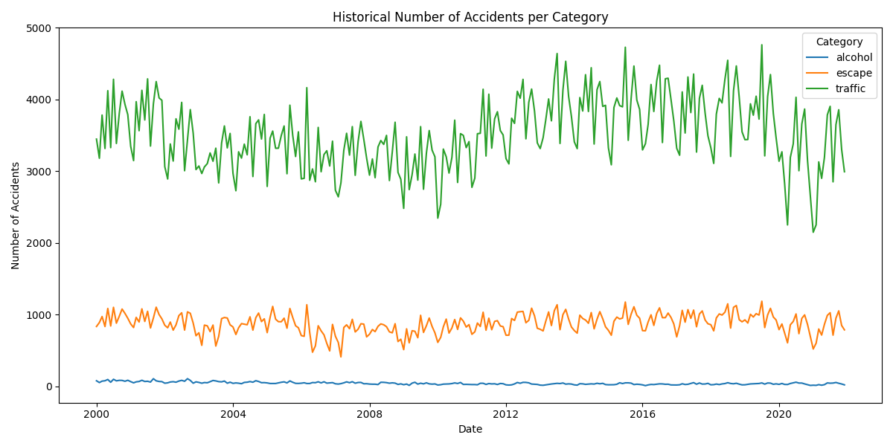
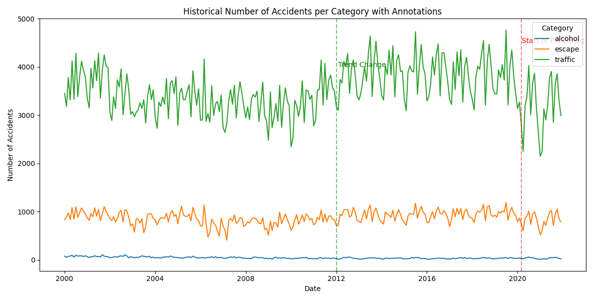
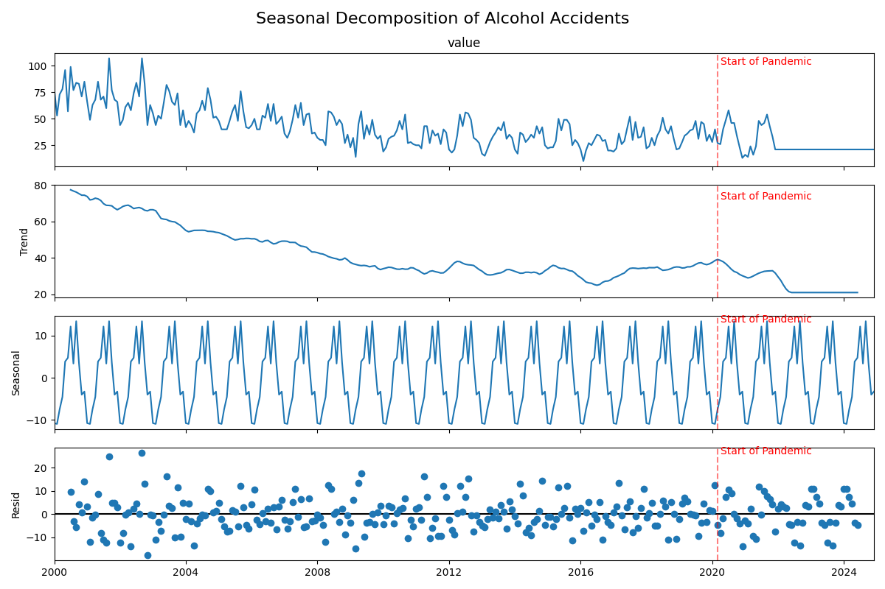
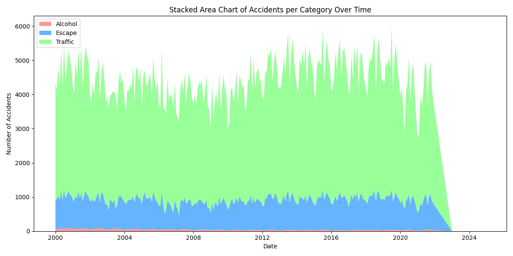
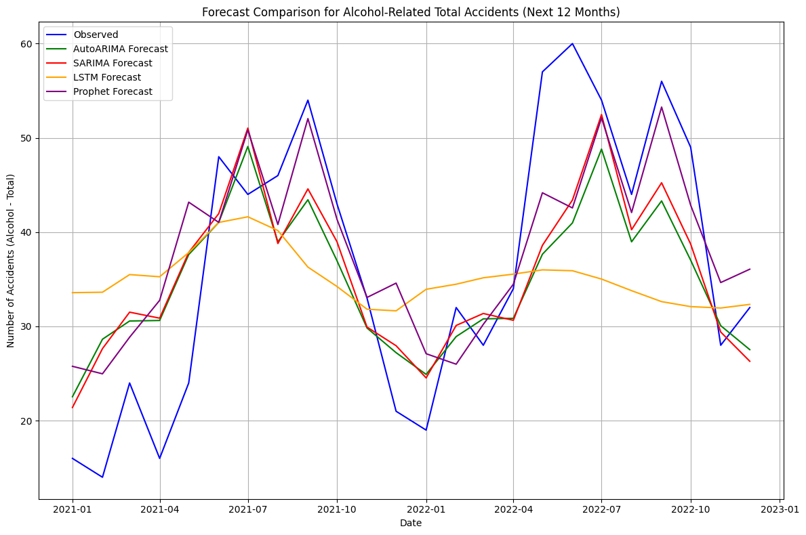

# Digital Product School AI Engineer Challenge 
## Accident Prediction API

This repository contains my work submitted as part of the selection process for the DPS 2025 March batch. The task was to create a forecasting model for accident data and deploy it through an API endpoint that operates as follows:


The API is deployed at the following URL:
```
https://dps-accident-forecasting.onrender.com
```
### **Request:**
```json
{
    "year": 2020,
    "month": 10
}
```

### **Response:**
```json
{
    "prediction": value
}
```


## **Tasks and Workflow**

### **Task 1: Visualization, EDA, and Model Creation**

#### **1. Exploratory Data Analysis (EDA) and Visualizations**

The EDA and data visualizations were carried out to gain insights into the accident dataset and can be found in the exploratory notebook. Here are some of the key visualizations and analyses that were conducted:

- **Historical Number of Accidents per Category**: A line plot was created to visualize the number of accidents over time for each category (alcohol, escape, traffic). This helps in understanding the overall trends and seasonality of the accidents.

  

- **Accidents with Annotations**: A version of the historical accident plot with annotations highlighting significant events, such as the start of the pandemic and notable trend changes.

  

- **Seasonal Decomposition**: Seasonal decomposition was performed for each accident category to observe trends, seasonality, and residuals over time. This analysis provided a deeper understanding of underlying seasonal patterns and trends.

  

- **Stacked Area Chart**: A stacked area chart was used to visualize the proportion of accidents per category over time. This chart shows how the contribution of each category changes over the years.

  

#### **2. Model Creation with Prophet**

The Prophet model was chosen for forecasting as it is robust, easy to tune, and suitable for time series data with yearly seasonality.

- The model was trained and optimized using hyperparameter tuning, with the specific parameter grid available in the [model training notebook](utilities/helpers/accident/src/final_model.ipynb).
- Cross-validation was performed with a horizon of 1 year, training over multiple windows to ensure the model's reliability.

**Prophet Plot for the Model:**



#### **3. Handling Data and Model Training**

- The data was preprocessed to handle missing values and filter accident types.
- Outliers were treated using the IQR method to ensure stable model performance.
- Hyperparameter tuning for the Prophet model included `changepoint_prior_scale`, `seasonality_prior_scale`, and `seasonality_mode`.

**Model Performance Summary**:

```txt
Mean Absolute Error (MAE): 7.50
Root Mean Squared Error (RMSE): 9.05
R^2 Score: 0.60
```

These metrics were derived from evaluating the model on the test data (data points after 2020).

### **Task 2: Publishing & Deploying the Application**

The application was Dockerized and deployed using FastAPI, providing an endpoint to generate forecasts based on the provided year and month.

**Deployment Setup**:

- **Docker**: The application was containerized to ensure a consistent runtime environment.
- **FastAPI**: The web framework was chosen for its performance and ease of use, allowing us to expose our model through REST API endpoints.

#### **Endpoints Provided**:

**Forecast Endpoint**:
   - **Health check URL**: [POST /accident](https://dps-accident-forecasting.onrender.com)
   - **Description**: Accepts year and month in JSON format and returns a predicted accident value.
   
   Example request:

   ```json
   {
     "year": 2021,
     "month": 10
   }
   ```

   Example response:

   ```json
   {
     "prediction": 42.36
   }
   ```

## **Running the Application**

### **Prerequisites**:

- **Docker**: Ensure Docker is installed on your system.
- **Python Dependencies**: Listed in `requirements-prod.txt`.

### **Steps to Run the Application**:

1. **Clone the Repository**:
2. **Build the Docker Image**:

   ```bash
   docker build -t dps-accidents-app:latest .
   ```

3. **Run the Docker Container**:

   ```bash
    docker run -d \                           
    --name dps-accident-container \
    -p 8000:8000 \
    dps-accidents-app:latest   
    ```

4. **Access the Application**:

   The application will be available at `http://localhost:8000`.

   - **Swagger UI**: Documentation at `http://localhost:8000/docs`
   - **API**: Access the `/api/v1/accident/` endpoint for forecasting.

### **Testing the Forecast API**:

To test the forecast endpoint, use the following curl command:

```bash
curl -X POST "http://localhost:8000/api/v1/accident/" \
     -H "Content-Type: application/json" \
     -d '{"year": 2021, "month": 10}'
```

## **Model Performance and Evaluation**

- **Cross-Validation**: Cross-validation was conducted with a horizon of 365 days, and performance metrics were calculated for each fold.
- **Outlier Handling**: Outliers were handled using the Interquartile Range (IQR) method to ensure stable forecasting.
- **Holidays**: German public holidays were included as additional seasonality to improve model accuracy.

## Directory Structure
Here is an overview tree structure of the directory. This architecture is designed to be flexible and scalable for future enhancements.

```
|-requirements.txt
|-Dockerfile
|-utilities
| |-core
| | |-exceptions.py
| |-api
| | |-v1
| | | |-endpoints
| | | | |-accident.py           <- endpoint route
| | | |-api.py
| | |-health.py                 <- check app health at 0.0.0.0:port/
| |-main.py
| |-helpers                     <- write helper functions
| | |-response.py
| | |-accident                   
| | | |-src                     <- store models, data, plots
| | | |-accident_pred.py        <- forecasting driver code
|-.dockerignore
|-logs
| |-application.log             <- store one log file per helper
|-.gitignore
|-start-server.py               <- run server
```